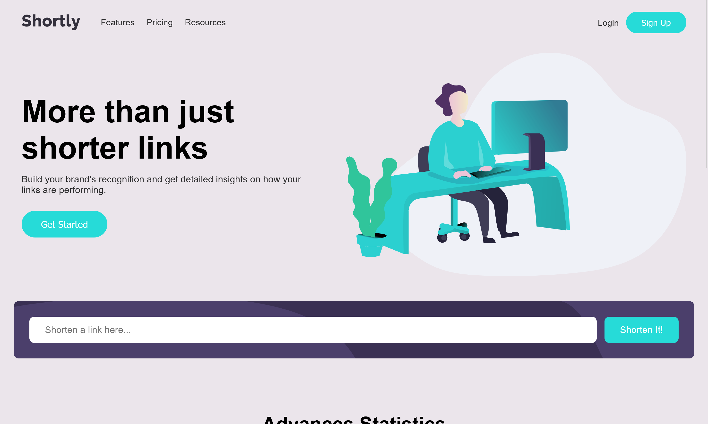

# 🔗 URL Shortener Landing Page

A responsive and modern landing page for a fictional URL shortening service. Built using **HTML**, **CSS**, and **JavaScript**, this project features a sleek user interface, responsive design, and mobile-friendly navigation.

---

## 🌐 Live Preview

[🔴 View Live Demo](https://sudhanshuverse.github.io/url-shortening/)
_(Replace the above link with your deployment URL, e.g., GitHub Pages, Netlify, Vercel)_

---

## 📸 Screenshots

### 💻 Desktop View



---

## 🚀 Features

- Fully responsive design
- Mobile-friendly hamburger menu
- CTA section and feature cards
- Clean layout using **CSS Flexbox**
- Modern fonts from Google Fonts
- Ready for integration with real URL shortening API

---

## 🛠️ How to Use

1. **Clone the repository**

   ```bash
   git clone https://github.com/sudhanshuverse/url-shortening.git
   cd url-shortener-landing-page
   ```

2. **Open index.html in your browser**

    ```bash
    open index.html
    ```

2. **Customize**

- Update assets or logo in the /assets folder

- Connect the input field to a backend API for URL shortening

- Deploy using GitHub Pages, Netlify, or Vercel


## 📌 Future Improvements

- Add real URL shortening API (e.g., Bitly or Rebrandly)

- Add URL validation and error handling

- Display shortened links dynamically

## 🧑‍💻 Author
Made by Sudhanshu Kumar

## License
This project is open source and available under the MIT License.
